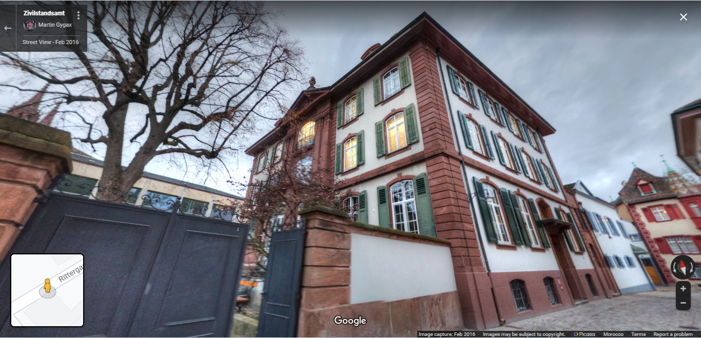
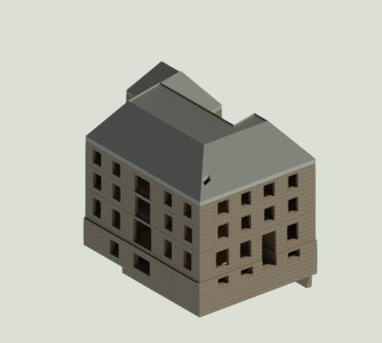
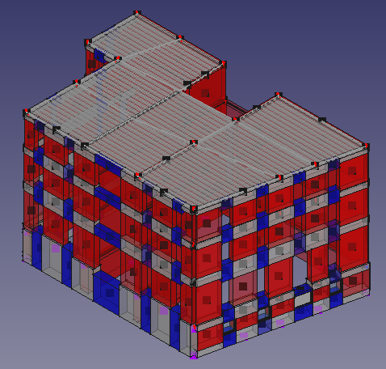

# Building characteristics

General characteristics:
-	Address: Rittergrasse 11, Basel Switzerland
-	Office building, commercial and administration usage
-	Year of construction: 1901
-	Number of storeys: 3 without counting basement and attic
-	Construction volume: 7098 m3
-	Floor boundary area: 340  m2
-	Floor average net area: 280 m2
-	Assured value: 8 mio CHF

Structural characteristics:
-	Massive stone masonry shell (exterior and some interior walls)
-	Timber wood floor slabs
-	Pitched roof 
-	More massive stone masonry wall foundations 

**3D streetview**

**BIM model**

**EFM model**

