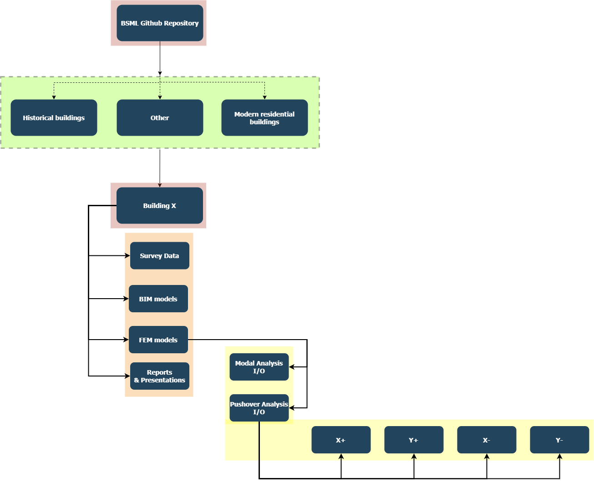

# BSMD
Buildings structural models database

  **Data organization** 

Follow the diagram below in order to organize data.

  **Data relationship** 

See below how data is currently related.

  **Projected data relationship**

See below how data will be related once the interoperability issues will be fixed.

 
